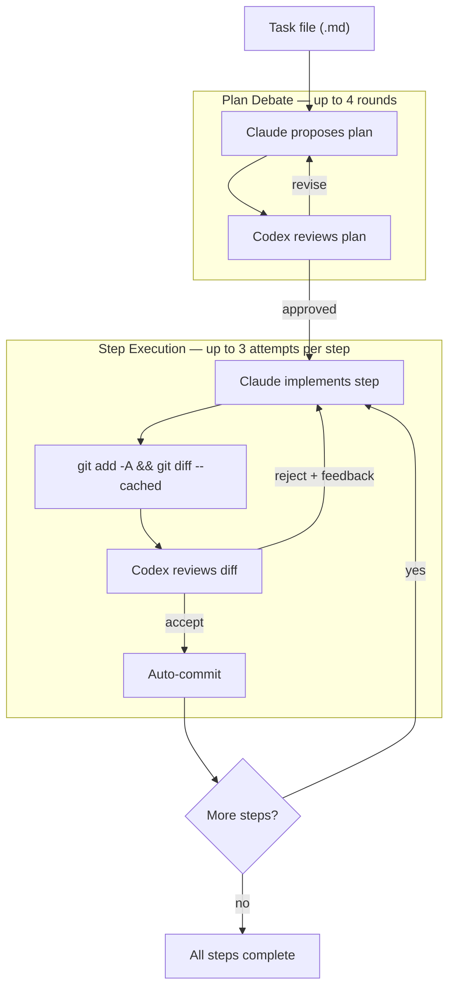

# srachka

AI debate orchestrator — Claude vs Codex.

Claude proposes, Codex critiques. They argue until the plan is good enough, then Claude implements step by step while Codex reviews every diff.

## How it works



**Two debate loops:**
- **Plan debate** — Claude drafts a step-by-step plan, Codex reviews. Back and forth until approved or rounds exhausted.
- **Step execution** — For each step: Claude implements, Codex reviews the diff. On reject, Claude gets feedback and tries again.

## Install

```bash
pipx install -e ~/personal/ai_srachka
```

This makes `srachka` available globally from any directory.

## Quick start

```bash
cd ~/projects/my-app

# 1. Create a plan (Claude proposes, Codex reviews, they debate)
srachka plan --task-file .srachka/tasks/feature.md

# 2. Execute steps (Claude implements, Codex reviews, auto-commit on accept)
srachka do-step          # runs current step
srachka do-step          # runs next step
srachka do-step          # ...until all done

# Utilities
srachka show-step        # see current step
srachka next-step        # skip to next step
srachka review-diff      # manually ask Codex to review current diff
srachka logs             # tail -f latest debate log
srachka doctor           # check Claude/Codex auth status
```

## Autonomous mode

`srachka init` prints a full orchestrator prompt for Claude. Paste it into Claude and let it drive the entire workflow autonomously:

```bash
srachka init | pbcopy
# paste into Claude, give it a task — it handles branching, planning,
# step-by-step implementation, final validation, and PR creation
```

## Project layout

```
srachka_ai/              # source code
tests/                   # tests
.srachka/                # runtime data (gitignored except schemas/)
  config.json            # user config overrides
  schemas/               # JSON schemas for Codex (tracked in git)
  tasks/                 # task files for srachka (gitignored)
  runs/                  # plan state, reviews per run
  logs/                  # full debate logs
```

## Config

`.srachka/config.json` — all fields optional, shown with defaults:

```json
{
  "claude_command": ["claude", "-p"],
  "claude_implement_command": ["claude", "-p"],
  "codex_command": ["codex", "--ask-for-approval", "never", "exec"],
  "max_plan_rounds": 4,
  "max_step_fix_rounds": 2,
  "provider_timeout_s": 600
}
```

- `claude_command` — used for planning and reviews
- `claude_implement_command` — used for implementation (can add `--effort max`)
- `provider_timeout_s` — kill provider process if it doesn't finish in time

## Prerequisites

```bash
claude --version   # Claude Code CLI
codex --version    # OpenAI Codex CLI
```

## Design principles

- Claude owns planning and implementation
- Codex owns critique and review
- The human decides product ambiguities
- Over-engineering is a first-class rejection reason
- Clean repo guard — srachka refuses to run on dirty repos
- Auto-commit after each accepted step
